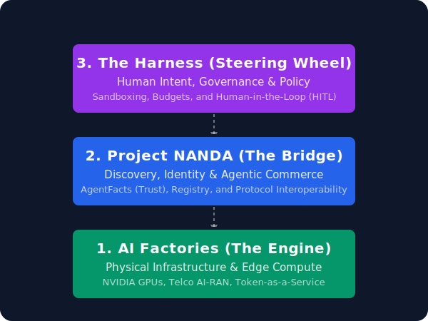

# The Agentic Economy: NANDA & Harness Explained

Welcome! If you are new to this repository or branch, you might be wondering: **What is NANDA, what is the Harness, and how do they work together?**

Here is the plain-English executive summary.

 

  

 

---

## What This Branch Captures

This branch turns the NANDA/Harness idea into linked docs plus a small offline prototype. Use this checklist to jump to the right artifact:

| Idea captured | Where to look |
| --- | --- |
| Harness makes NANDA easier by providing the governed execution environment around agent discovery. | [Plain-English overview](#the-solution-a-three-layer-architecture), [technical concept](docs/nanda-harness-agentic-commerce.md) |
| Harness is the human steering wheel, with human-in-the-loop approval before risky actions. | [Steering Wheel section](#3-the-steering-wheel-the-harness-governance--safety), [experiment README](experimental/nanda_harness_commerce/README.md) |
| NANDA acts as discovery, identity, trust, and marketplace-style coordination layer. | [Project NANDA section](#2-the-bridge-project-nanda-identity--commerce), [technical concept](docs/nanda-harness-agentic-commerce.md) |
| AgentFacts-like metadata carries identity, trust, quality, security, and commercial evidence. | [fixture index](experimental/nanda_harness_commerce/fixtures/nanda_index.json), [simulator checks](experimental/nanda_harness_commerce/simulator.py) |
| Skill import flow: discover a remote skill, verify it, import a disabled binding, then wait for approval. | [Workflow](#the-workflow-in-action), [experiment README](experimental/nanda_harness_commerce/README.md), [expected plan](experimental/nanda_harness_commerce/fixtures/expected_plan.json) |
| Governance, security, quality, budget, audit, and revocation checks happen before a skill is enabled. | [policy fixture](experimental/nanda_harness_commerce/fixtures/harness_policy.json), [unit tests](tests/unit/test_nanda_harness_commerce.py) |
| Commercial layer is modeled as usage metering and settlement metadata, not real payment settlement. | [technical concept](docs/nanda-harness-agentic-commerce.md#commercial-layer-model), [NANDA-style fixture](experimental/nanda_harness_commerce/fixtures/nanda_index.json) |
| AI Factory / token-metered economy is included as the infrastructure/economic context. | [AI Factories section](#1-the-engine-ai-factories-infrastructure), [architecture SVG](docs/nanda_architecture.svg) |
| Imported agents must not run blindly; accepted imports remain disabled until human approval. | [expected plan](experimental/nanda_harness_commerce/fixtures/expected_plan.json), [simulator](experimental/nanda_harness_commerce/simulator.py) |

**Boundary:** this branch captures the architecture and control-plane pattern. It does not implement live NANDA interoperability, real cryptographic AgentFacts verification, real payment settlement, or remote skill execution.

## The Problem
Imagine you want an AI agent to automatically optimize your telecommunications network. You could just give the AI the keys to your network, but that is incredibly dangerous. It might break something, spend too much money, or accidentally violate corporate security policies. 

Furthermore, where does the AI "live"? How does it pay for the computing power it needs? How does it find other specialized AI agents to help it?

## The Solution: A Three-Layer Architecture

We solve this by breaking the problem into three distinct layers. Think of it like a business: you need an engine (the workers), a marketplace (the bridge), and a steering wheel (the management).

### 1. The Engine: AI Factories (Infrastructure)
* **What it is:** The physical hardware. In the modern telecom world (like the AI-RAN vision proposed by NVIDIA), base stations and edge servers don't just route calls—they manufacture "AI tokens."
* **What it does:** It provides the raw, high-speed computing power required for agents to "think." 
* **The Economy:** Instead of renting servers by the hour, you pay for the intelligence output (Tokens-as-a-Service).

### 2. The Bridge: Project NANDA (Identity & Commerce)
* **What it is:** The decentralized internet protocol for AI agents. Think of it as the "DNS and LinkedIn" for the agentic economy.
* **What it does:** It provides a registry where agents can discover each other. When an agent needs a specific skill, it searches the NANDA index.
* **The Trust Factor:** NANDA uses **AgentFacts** (cryptographic ID cards). Before you hire an agent, NANDA proves who built the agent, what its reputation is, and how much it charges.

### 3. The Steering Wheel: The Harness (Governance & Safety)
* **What it is:** Your enterprise control panel. This is what you (the human) actually interact with.
* **What it does:** The Harness is where you input your goals. It is the protective sandbox that wraps around the AI agents.
* **How it keeps you safe:** When the Harness discovers a new skill via NANDA, it doesn't just run it blindly. It runs a **Governance Check**:
  * *Is this agent verified by NANDA?*
  * *Does it meet our security standards?*
  * *Is the price-per-token under our budget?*
* **Human-in-the-Loop:** Even if an agent passes all checks, the Harness will pause and wait for a human (you) to click "Approve" before making any changes to the production network.

---

## The Workflow in Action

When you ask the system to perform a complex task, here is what happens behind the scenes:

1. **You set the goal** in the **Harness** (e.g., "Audit our 5G core security").
2. The **Harness** realizes it needs a specialized auditor skill, so it queries the **NANDA** marketplace.
3. **NANDA** finds a highly-rated auditor agent and sends its *AgentFacts* to the Harness.
4. The **Harness** verifies the security credentials and budget limits. It imports the skill but keeps it paused.
5. The **Harness** asks you: *"I found this verified auditor for $5. Do you approve?"*
6. You click **Approve**.
7. The agent executes the task using compute power provided by the underlying **AI Factory**.

**In summary:** The AI handles the heavy lifting, NANDA handles the logistics and trust, and the Harness ensures you always maintain the authority and control.
