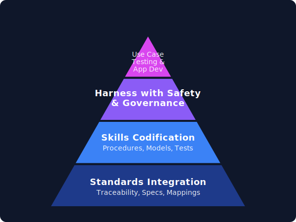

# Telco Systems Integration Lab

Formal, standards-traceable workspace for end-to-end telco integration across 3GPP, TM Forum, and O-RAN.



Core rule: preserve originals. Intake from existing workspaces is copy-only and must be recorded in `traceability/` before source code is migrated.

Authoritative release/conformance status lives in `traceability/standards_release_register.yaml`; this file is a derived view.

## Buckets

- `specs/` official standards and versioned reference material
- `traceability/` release register, source inventory, copy manifest, conformance matrix, evidence snapshots
- `models/` canonical and standard-native models kept separate
- `procedures/` standards-based flows, state machines, and release-tracking procedures
- `adapters/` protocol/API/simulator/hardware connectors
- `services/` deployable service implementations
- `capabilities/` vertical end-to-end slices linking models, procedures, adapters, services, and tests
- `tests/` unit, integration, interoperability, conformance, regression, and fixtures
- `docs/` architecture, decisions, migration plans, and runbooks
- `apps/` UI/dashboard/front-end applications
- `config/` environment and service configuration
- `scripts/` safe operational scripts
- `build_logs/` curated run evidence only
- `references/` source workspace references and learning/reference assets
- `external/` third-party integrations or externally sourced components
- `experimental/` non-authoritative experiments
- `vendor_profiles/` vendor-specific profiles and deviations

## Documentation

Start with the formal docs index: [`docs/README.md`](docs/README.md).

Key docs:

- [`AGENTS.md`](AGENTS.md) — Codex/agent security rules for public-safe commits
- [`docs/adr/0001-external-implementation-profiles.md`](docs/adr/0001-external-implementation-profiles.md) — external implementation profiles and capability-domain policy
- [`docs/end-to-end-telco-capability-blueprint.md`](docs/end-to-end-telco-capability-blueprint.md) — slice-first plan for building the complete standards-traceable telco lab
- [`docs/architecture.md`](docs/architecture.md) — bucket architecture and source/evidence flow
- [`docs/standards-mapping.md`](docs/standards-mapping.md) — 3GPP, TM Forum, and O-RAN mapping
- [`docs/core-network.md`](docs/core-network.md) — copied mock 5G core inventory and caveats
- [`docs/ran-components.md`](docs/ran-components.md) — copied RAN inventory and caveats
- [`docs/oran-components.md`](docs/oran-components.md) — copied O-RAN/RIC/E2 inventory and caveats
- [`docs/tmforum-components.md`](docs/tmforum-components.md) — TM Forum evidence and CTK baseline caveats
- [`docs/api-reference.md`](docs/api-reference.md) — current API evidence navigation
- [`docs/testing.md`](docs/testing.md) — test bucket boundaries and evidence promotion path
- [`docs/conformance-boundary.md`](docs/conformance-boundary.md) — what is proven, what is not, and claim gates

## Quick Operator Loop

Use the root `lab` command for the current runnable experience:

```bash
./lab up                 # start the BF3 5G core + RAN + O-RAN services in the background
./lab services           # show live service/process/health status
./lab chatter core       # show recent service log chatter, prefixed by service
./lab chatter all --follow
                         # live merged tail of lab-captured service logs
./lab scenario pdu-session
                         # trigger AMF/SMF/UPF demo traffic, with safe fallbacks
./lab scenario radio     # advance the NTN radio trace like the terminal screenshot
./lab down               # stop only lab-tracked services
./lab smoke              # run non-daemon import/AST smoke readiness for copied mock services
./lab test               # run the repeatable pytest suite
./lab status             # show latest combined readiness evidence
./lab demo               # print a concise demo-readiness summary
```

`./lab up` now uses a lab-owned service inventory that mirrors the BF3 launcher service list while avoiding the fragile macOS `psutil.net_connections()` path. It starts a cold lab-owned core in dependency order (`NRF -> UPF -> SMF -> AMF`) so service discovery has a chance to settle, writes authoritative PID/control state to `.lab/state/lab_services.json`, keeps an operator evidence copy at `build_logs/lab_services.json`, and writes per-service logs to `build_logs/services/`. It does **not** kill arbitrary/untracked processes; if a required port is already occupied, it marks that service as external/already-listening and tells you where to inspect.

A `*` beside a PID in `./lab services` means the process was detected on the port but is external/untracked, so `./lab down` will not kill it.

To recreate the old foreground “all services talking” feel without breaking the stable background launcher, use `./lab chatter` in one terminal and `./lab scenario ...` in another. `./lab chatter` reads the lab-owned per-service logs and prints them with service prefixes; `./lab scenario pdu-session` drives AMF → SMF → UPF calls and then asks UPF to process simulated user-plane traffic. `./lab scenario radio` advances the NTN radio simulator and surfaces the `[HM]`, `[NR_MAC]`, `[NR_RRC]`, and `[PHY]` lines similar to the screenshot. External/untracked `*` services may not stream their original stdout into `build_logs/services/`, so scenario commands append clearly labeled `SCENARIO` request/response transcript lines to the relevant service logs.

Current claim boundary: these commands prove runtime/demo readiness, copied-source import readiness, and repeatable regression checks. They do **not** prove formal 3GPP, O-RAN, or TM Forum conformance.
