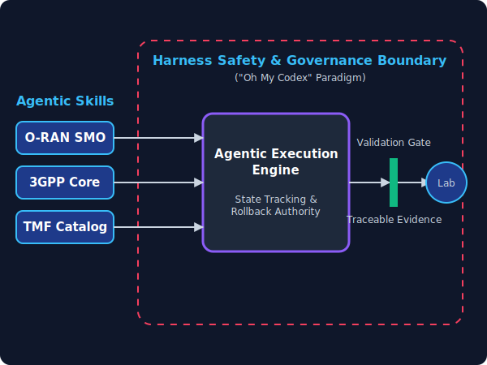

# The Agentic Harness (The Engine)

If the Architecture Triangle represents the *structural layers* of the Telco Systems Integration Lab, this Harness represents the **engine** running the show. 

"Agentic Telecom" isn't just about an LLM writing scripts. The core of this lab is a massive safety and governance harness that turns O-RAN and 3GPP components into constrained, trackable *skills*—an "Oh My Codex" reality for telecommunications.

## What this architecture enables:

1. **The Containment Field:** The AI agent doesn't have wild access to the network. Everything it does is trapped inside a governance boundary.
2. **Modular Agentic Skills:** The O-RAN SMO, 3GPP Core, and TMF Catalog aren't just software deployments here; they are packaged as **Agentic Skills**. The harness consumes them like cartridges.
3. **Agentic Execution Engine:** This core maintains state tracking and rollback authority. If an agent tries a configuration change and it violates an invariant, the engine catches it and rolls it back. 
4. **Validation Gate:** Before any change touches the actual Lab network, it must pass through the Validation Gate, automatically generating traceable evidence.
